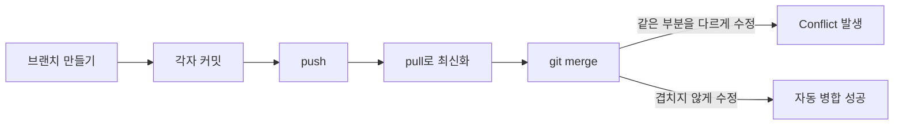
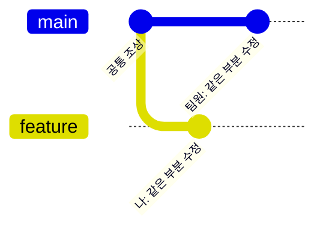
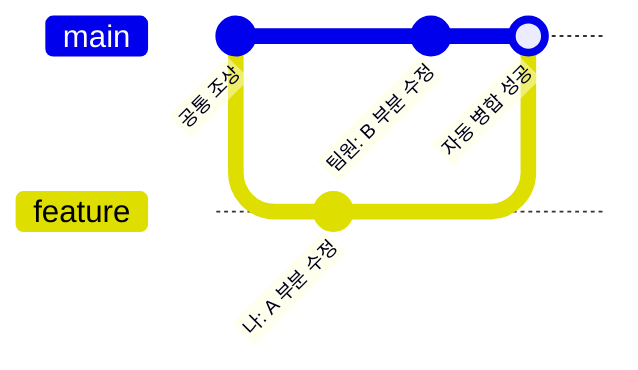
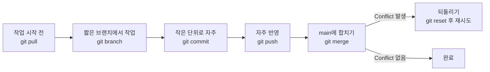
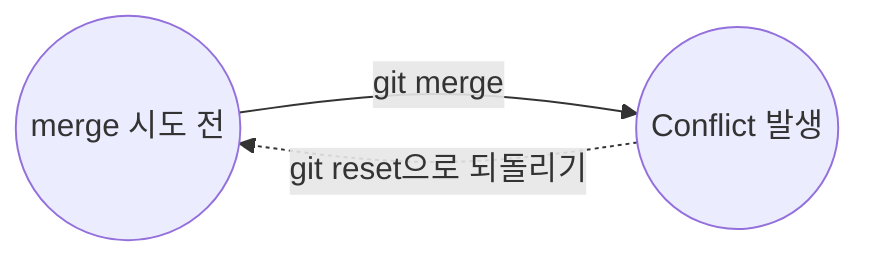

## 들어가며

이번 주에 브랜치를 나눠서 작업하다가 `git merge` 도중 conflict를 몇 번 겪었다.
선생님이 학생에게 설명해주듯, 이번 주에 배운 개념(브랜치, push, pull, merge, 되돌리기)만 가지고
**conflict가 왜 생기는지**, **어떻게 줄일 수 있는지**를 정리해본다.

---

## 1. Conflict는 언제 만나게 될까

Conflict는 `git merge`를 실행하는 순간에 나타난다.
그 전 단계인 브랜치 생성, 커밋, push, pull은 문제없이 잘 진행되다가
마지막에 두 브랜치를 합치려는 순간 막히는 것이다.

즉, conflict는 merge 전 단계의 실수가 아니라
**"같은 원본의 같은 부분을 서로 다르게 고쳤을 때"** merge 단계에서 드러나는 문제다.

---

## 2. 왜 같은 부분을 고치게 될까

브랜치를 나눠도, 시작점(공통 조상)이 같으면 두 사람이 같은 곳을 건드릴 수 있다.

이 상태에서 `git merge feature`를 실행하면,
Git은 어느 쪽 수정을 최종 결과로 삼아야 할지 스스로 판단하지 못해서 conflict를 표시한다.

반대로 서로 다른 부분을 수정했다면 아래처럼 문제없이 합쳐진다.

---

## 3. 이번 주 배운 명령어로 conflict 줄이기

conflict 자체를 아예 없앨 수는 없지만,
이번 주에 배운 명령어만으로도 **겹치는 부분을 줄여서** 발생 횟수는 줄일 수 있다.

| 명령어 | 언제 쓰나 |
|---|---|
| `git pull` | 작업을 시작하기 전에 최신 상태를 받아서 원본과 차이를 줄이고 싶을 때 |
| `git branch` | 기능별로 작업 공간을 나눠서 같은 파일의 같은 부분을 건드리지 않게 하고 싶을 때 |
| `git commit` | 변경 사항을 작게, 자주 나눠서 기록하고 싶을 때 |
| `git push` | 작업이 끝난 부분을 자주 원격 저장소에 반영해서 팀원과의 차이를 줄이고 싶을 때 |
| `git merge` | 브랜치 작업을 마치고 main에 합치고 싶을 때 |
| `git reset` | merge 도중 꼬였을 때 이전 상태로 되돌려서 다시 시도하고 싶을 때 |

이 습관들을 순서대로 이어보면 다음과 같은 흐름이 된다.

핵심은 **브랜치를 오래 붙잡고 있지 않는 것**이다.
브랜치를 오래 유지할수록 main과의 차이가 커지고,
그만큼 같은 부분을 건드릴 확률도 함께 커지기 때문이다.

---

## 4. Conflict가 나면 되돌리기부터

merge 도중 conflict가 나서 당황스러우면, 무리하게 해결하려 하기보다
`git reset`으로 merge 시도 이전 상태로 되돌린 뒤 다시 차분히 시도하는 것도 방법이다.

되돌린 뒤에는 `git pull`로 최신 상태를 다시 받고,
브랜치에서 겹치는 부분을 먼저 확인한 다음 merge를 다시 시도하면 된다.

---

## 배운 점

- Conflict는 merge 단계에서 처음 드러나지만, 원인은 **그 전에 같은 부분을 각자 수정했기 때문**이다.
- 브랜치를 짧게 유지하고, `pull`로 자주 최신화하고, 작은 단위로 `commit`/`push`할수록 conflict 확률이 줄어든다.
- Conflict가 났을 때 당황하지 않고 `git reset`으로 되돌린 뒤 다시 시도하는 것도 방법이다.
