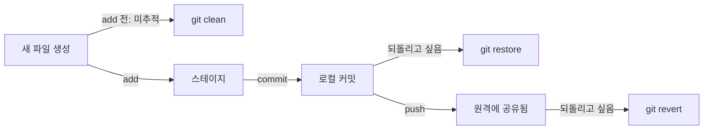

## 새로운 개념

`git restore`, `git clean`, `git revert`는 셋 다 "되돌린다"는 느낌이 있어서 처음엔 언제 뭘 써야 하는지 헷갈렸다.

세 가지 상황을 직접 만들어서 비교해봤다.

1. 이미 커밋된 파일을 수정만 하고(커밋은 안 함) `restore`
2. 새로 만든 파일(아직 `add`도 안 함)에 바로 `restore`
3. 새로 만든 파일을 커밋까지 한 다음 `revert`

## 흥미로운 지점: 새 파일에 restore가 안 먹힌다

1번(이미 커밋된 파일 수정 후 restore)은 예상대로 수정 전 내용으로 돌아왔다.

그런데 2번(새 파일 + restore)은 에러가 났다. "git에 알려진 어떤 파일과도 매칭되지 않는다"는 내용이었다.

왜 이런 차이가 날까 생각해보니, `restore`는 "복원"하는 명령인데 복원하려면 되돌아갈 원본(기준점)이 있어야 한다. 이미 커밋된 파일은 그 기준점(직전 커밋)이 있지만, 방금 만든 새 파일은 git이 한 번도 추적한 적이 없어서 기준점 자체가 없다.

여기서 헷갈렸던 부분은 "이 저장소에 커밋이 하나도 없어서 그런가?"였는데, 실제로는 저장소 전체의 커밋 히스토리와는 상관없었다. 저장소에 커밋이 이미 여러 개 쌓여 있어도, **오늘 새로 만든 그 파일 자체가 한 번도 추적(tracked)된 적이 없다면** 똑같이 기준점이 없어서 에러가 난다. 즉 기준이 되는 건 저장소 단위가 아니라 파일 단위의 추적 여부였다.

## 핵심 원리: 기준점의 유무

세 명령어를 실험해보고 정리한 기준은 다음과 같다.

| 명령어 | 대상 | 기준점 | 동작 |
|---|---|---|---|
| `git clean` | 미추적 파일 | 없음 | 파일을 그냥 삭제 (복원이 아니라 제거) |
| `git restore` | 추적 중인 파일 | 직전 커밋 또는 스테이지 | 그 시점의 내용으로 되돌림 |
| `git revert` | 커밋 | 과거 커밋 | 히스토리는 남기고, 되돌리는 내용을 담은 새 커밋을 쌓음 |

`clean`을 실험할 땐 처음에 "마우스로 파일 지우는 거랑 뭐가 다르지?"라는 생각이 들었는데, 미추적 파일이 여러 개 흩어져 있을 때 하나하나 찾아 지우는 대신 명령 하나로 처리할 수 있다는 게 차이였다. `git clean`은 "되돌리는" 명령이 아니라 애초에 되돌아갈 상태 자체가 없는 파일을 지우는 명령이라는 게 더 정확한 표현이었다.

`revert`를 실험할 때 예상 밖이었던 부분은, 되돌린 커밋이 히스토리에서 사라지는 게 아니라 그 위에 **취소 내용을 담은 새 커밋**이 하나 더 쌓인다는 점이었다. `git log`로 확인해보니 원래 커밋도 그대로 있고, 그 위에 revert 커밋이 새로 생겨 있었다.

## 기존 지식과 연결: add → commit → push 흐름과 매칭

이 세 명령어를 `add` / `commit` / `push` 단계와 겹쳐보면 언제 뭘 써야 하는지가 더 명확해졌다.

- **add 전(미추적)** → 기준점이 없음 → `clean`
- **add ~ commit 후, push 전(로컬에만 있음)** → 기준점이 있고, 나만 아는 상태 → `restore`
- **push 후(팀원과 공유됨)** → 기준점이 있고, 남도 의존하는 상태 → `revert`

## 활용 방향: 왜 push 이후엔 revert를 써야 할까

처음엔 "커밋을 취소하고 싶으면 그냥 히스토리에서 지워버리면 안 되나?"라는 생각도 들었다.

하지만 이미 `push`해서 팀원들이 `pull`을 받아간 상태라면, 그 커밋을 히스토리에서 통째로 지우는 방식(예: 강제로 과거를 조작하는 방식)은 팀원의 로컬 히스토리와 원격 히스토리를 어긋나게(diverge) 만든다. 반면 `revert`는 과거를 건드리지 않고 새 커밋만 추가하는 방식이라, 다음에 팀원이 `pull`을 받아도 히스토리가 자연스럽게 이어진다.

결국 세 명령어를 가르는 기준은 하나로 요약된다.

> 이 변경이 **나만 아는 로컬 상태**인가, 아니면 **다른 사람도 이미 의존하고 있는 상태**인가.

로컬 상태라면 `clean`/`restore`로 편하게 되돌리면 되고, 이미 공유된 상태라면 히스토리를 보존하는 `revert`가 안전하다.

## 참고 자료

- [Git 공식 문서 - git-restore](https://git-scm.com/docs/git-restore)
- [Git 공식 문서 - git-clean](https://git-scm.com/docs/git-clean)
- [Git 공식 문서 - git-revert](https://git-scm.com/docs/git-revert)
