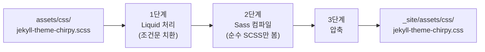
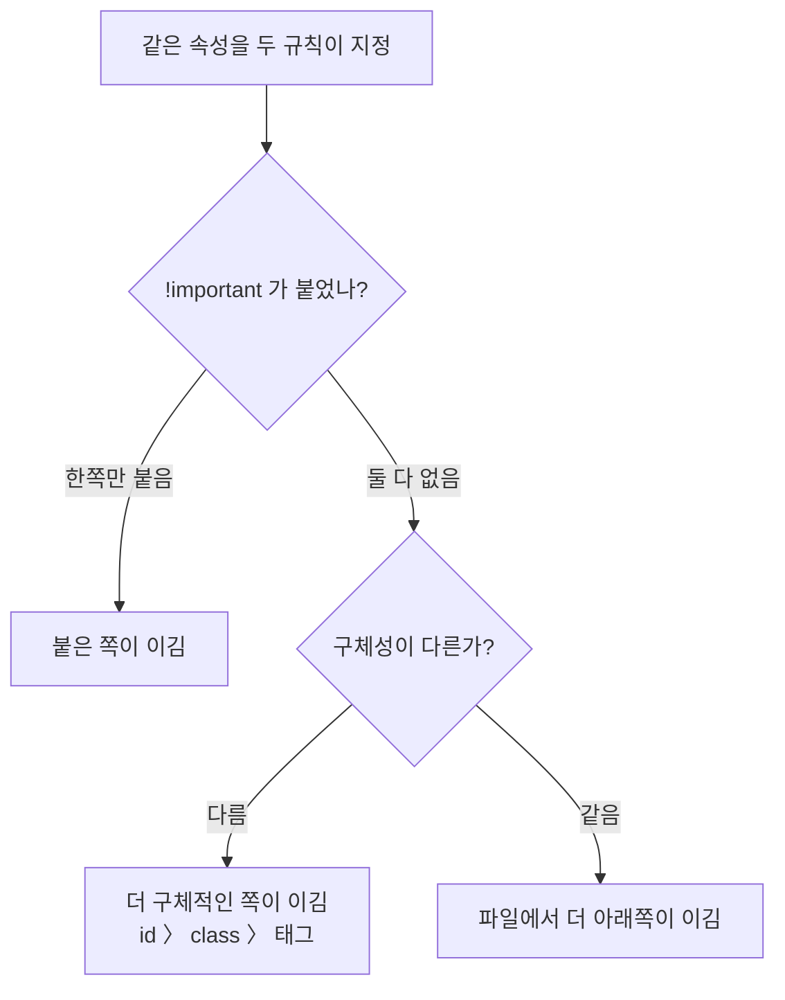

## 문제 상황

수업에서 Flexbox, Grid, `transition`, `transform`, `@keyframes`를 배웠다. 연습 파일에만 써보고 끝내기가 아까워서, 지금 운영 중인 이 블로그에 직접 적용해보기로 했다.

목표는 소박했다. **Chirpy 테마의 디자인은 그대로 두고**, 게시글 카드에 hover 효과 정도만 얹는 것.

그런데 시작부터 막혔다. **CSS 파일이 어디에도 없었다.**

```
my-blog/
├── _posts/
├── _tabs/
├── _config.yml
├── Gemfile
└── index.html          ← _sass 폴더도, css 파일도 없음
```

수정할 파일을 못 찾으니 아무것도 시작할 수 없었다.

## 왜 CSS 파일이 없었나

`Gemfile`을 보니 답이 있었다.

```ruby
gem "jekyll-theme-chirpy", "~> 7.6"
```

Chirpy를 **gem(루비 라이브러리 패키지)으로 설치해서 쓰는 구조**였다. 테마 본체는 내 프로젝트가 아니라 Ruby gem 안에 들어 있고, 빌드할 때 Jekyll이 거기서 꺼내 쓴다. 프로젝트에 파일이 없는 게 정상이었던 것이다.

문제는 내 윈도우 환경에 Ruby가 아예 없다는 점이었다.

```console
$ ruby -v
bash: ruby: command not found
```

gem이 로컬에 설치돼 있지 않으니 테마 소스를 열어볼 수조차 없었다. 대신 **GitHub에 있는 테마 원본 저장소를 직접 확인**하기로 했다. 내가 쓰는 버전(`~> 7.6` → v7.6.0)의 태그를 찾아서 소스를 읽었다.

## 테마 CSS를 덮어쓰는 올바른 방법

Jekyll에는 규칙이 하나 있다. **같은 경로의 파일이 프로젝트와 테마 gem 양쪽에 있으면 프로젝트 파일이 이긴다.**

Chirpy가 실제로 쓰는 CSS 진입점은 이 파일 하나였다.

```
assets/css/jekyll-theme-chirpy.scss
```

그래서 프로젝트에 **같은 경로로 파일을 만들면** 그게 테마 것을 대신하게 된다. 테마 폴더를 통째로 복사할 필요가 없다.

다만 내용을 아무렇게나 쓰면 안 된다. 테마 원본은 이렇게 생겼다.


```scss
---
---

@use 'abstracts/variables' with (
  $theme: '{{ site.theme_mode }}'
);

/* prettier-ignore */
@use 'main

  .bundle

';

/* append your custom style below */
```


이 두 개의 `@use`가 Chirpy CSS 전체를 불러온다. **이걸 지우면 사이트 스타일이 통째로 사라진다.** 내가 할 일은 맨 아래 "append your custom style below" 밑에 추가하는 것뿐이었다.

### VS Code가 빨간 줄을 그은 이유

파일을 만들자마자 에디터가 오류를 여러 개 띄웠다.

```
알 수 없는 키워드
{ 필요
@ 규칙 또는 선택기 필요
```

전부 Liquid 문법(``) 부분이었다. 처음엔 내가 뭘 잘못 쓴 줄 알았는데, **에디터의 오해**였다.

VS Code 내장 SCSS 검사기는 이 파일을 순수 SCSS로 읽는다. Liquid를 모르니 문법 오류로 보이는 것이다. 실제 빌드에서는 처리 순서가 다르다.



Liquid가 **먼저** 치환되어 사라지므로, Sass는 그 문법을 볼 일이 아예 없다. 실제 배포는 아무 문제 없이 됐다.

그리고 이 그림에는 오늘 계속 써먹게 될 사실이 하나 더 있다. **2단계에서 `@use`로 불러온 테마 CSS가 먼저 출력되고, 내가 아래에 쓴 CSS가 나중에 출력된다.** 이건 나중에 다시 나온다.

---

## 첫 번째 오답 — selector를 추측했다

카드 hover를 만들려고 이렇게 썼다.

```scss
#post-list .card-wrapper:hover {
  transform: translateY(-6px);
  box-shadow: 0 12px 30px rgba(0, 0, 0, 0.12);
}
```

`.card-wrapper`가 카드일 거라고 생각했다. 이름이 그렇게 생겼으니까.

테마의 `_layouts/home.html`을 열어보니 실제 구조는 이랬다.

```html
<article class="card-wrapper card">
  <a class="post-preview row g-0">
    <div class="card-body">...</div>
  </a>
</article>
```

그리고 테마 SCSS를 보니 결정적인 부분이 있었다.

```scss
/* _sass/pages/_home.scss */
#post-list .card {
  border: 0;
  background: none;   /* ← 바깥 상자는 투명하다 */
}

/* _sass/base/_base.scss */
.post-preview {
  border-radius: 10px;
  background: var(--card-bg);
  box-shadow: var(--card-shadow);   /* ← 카드처럼 보이는 건 여기 */
}
```

**배경, 그림자, 둥근 모서리는 전부 안쪽 `<a class="post-preview">`에 있었다.** 바깥 `.card-wrapper`는 투명한 껍데기였다.

내 코드대로 했다면 이렇게 됐을 것이다.

```
┌─────────────────┐   ← .card-wrapper 의 각진 그림자
│  ╭───────────╮  │
│  │  둥근 카드  │  │   ← 실제로 보이는 카드
│  ╰───────────╯  │
└─────────────────┘
```

`border-radius`는 자식에게 물려주는 속성이 아니다. 바깥 상자는 여전히 각진 사각형이라, 둥근 카드 뒤로 각진 그림자가 삐져나온다.

고친 코드는 이렇다.

```scss
#post-list .post-preview:hover {
  transform: translateY(-4px);
  box-shadow:
    var(--card-shadow),                /* 테마 기본 그림자 유지 */
    0 12px 24px rgb(0 0 0 / 10%);      /* 떠오른 만큼만 추가 */
}
```

색을 직접 적지 않고 `var(--card-shadow)`를 쓴 이유가 있다. Chirpy는 라이트/다크 테마별로 **같은 이름에 다른 값**을 정의해둔다. 이름으로 가리키기만 하면 다크모드가 저절로 따라온다. `rgba(0, 0, 0, 0.12)`처럼 박아 넣었다면 어두운 배경에서 검은 그림자가 안 보였을 것이다.

### 왜 margin이 아니라 transform인가

궁금해서 직접 비교해봤다. 개발자 도구에서 값을 40px로 과장하고 두 방식을 번갈아 적용해봤다.

| 방식 | 마우스 올린 카드 | 아래 카드들 |
|------|------------------|-------------|
| `margin-top: -40px` | 위로 이동 | **전부 딸려 올라감** |
| `transform: translateY(-40px)` | 위로 이동 | 제자리 |

브라우저는 화면을 그릴 때 단계를 나눈다.

```
① Layout    "어디에 얼마나 크게 놓을까" 계산
② Paint     그 자리에 색을 칠함
③ Composite 조각들을 겹쳐 최종 화면 완성
```

`margin`은 ①단계의 **입력값**이다. 값이 바뀌면 브라우저는 ①부터 다시 계산해야 한다(리플로우). 2번 카드가 짧아지면 3번이 어디로 갈지, 그럼 4번은... 줄줄이 다시 계산된다.

`transform`은 ③단계에서만 일한다. ①이 계산한 원래 자리는 **손도 안 댄다.** 요소는 여전히 그 자리를 차지하고 있고, 마지막에 그릴 때만 옮겨 그린다. 그래서 아무도 안 밀린다.

hover 효과에 `translateY`를 쓰는 이유가 이거였다.

---

## 두 번째 오답 — 이름이 겹쳐서 목차를 망가뜨렸다

이게 오늘 제일 큰 사고였다. 그리고 **에러가 하나도 안 났다.**

카드 등장 애니메이션을 만들었다.

```scss
@keyframes fade-up {
  from { opacity: 0; transform: translateY(12px); }
  to   { opacity: 1; transform: translateY(0); }
}

#post-list .card-wrapper {
  animation: fade-up 0.4s ease-out both;
}
```

배포하고 잘 되는 걸 확인했다. 그런데 배포된 CSS 파일을 직접 열어보다가 이걸 발견했다.

```css
@keyframes fade-up{from{opacity:0;margin-top:4rem}to{opacity:1}}   /* ← Chirpy 것 */
...
@keyframes fade-up{from{opacity:0;transform:translateY(12px)}...}  /* ← 내 것 */
```

**`fade-up`이라는 이름을 Chirpy가 이미 쓰고 있었다.** 게시글 페이지의 목차(TOC)가 그 대본을 참조하고 있었다.

```css
#toc-wrapper:not(.invisible) { animation: fade-up .8s; }
```

내 정의가 파일 뒤에 붙었으니, 목차는 이제 Chirpy가 의도한 `margin-top: 4rem`이 아니라 **내 `translateY(12px)`로 나타나고 있었다.**

### class 이름은 겹쳐도 되는데 왜 이건 안 되나

이 질문이 핵심이었다. `.card`라는 class는 Chirpy도 쓰고 Bootstrap도 쓰는데 아무 문제가 없다.

차이는 **이름의 역할**에 있었다.

| | 하는 일 | 겹치면 |
|---|---|---|
| `.card` | 화면에서 요소를 **골라낸다** (선택) | 선언들이 **합쳐진다** |
| `@keyframes fade-up` | 대본에 **이름표를 붙인다** (정의) | 나중 것이 **대체한다** |

`animation: fade-up`이라고 쓰면 브라우저는 "fade-up이라는 대본 **하나**"를 찾아와야 한다. 후보가 둘이면 곤란하니, 규칙이 단순하다 — 나중 정의만 남고 앞 것은 사라진다. 합쳐지지도 않는다. 변수 이름을 두 번 선언하면 덮어써지는 것과 같다.

해결은 이름을 고유하게 바꾸는 것뿐이었다.

```scss
@keyframes post-card-fade-up { ... }

#post-list .card-wrapper {
  animation: post-card-fade-up 0.4s ease-out both;
}
```

### CSS에서 전역으로 공유되는 이름들

같은 사고를 또 안 내려면 어디를 조심해야 하는지 정리해둘 필요가 있었다.

- `@keyframes` 이름
- CSS 변수(`--card-shadow` 같은 custom property)
- `@font-face`의 `font-family` 이름
- `counter-reset` / `counter-increment`의 카운터 이름

전부 "이름표를 붙이고 나중에 이름으로 찾아가는" 것들이다. 남의 테마 위에 얹을 때는 **접두사를 붙이는 게 안전하다.**

다만 CSS 변수는 조금 다르다. 덮어쓰는 게 **사고가 아니라 도구**가 될 수 있다. "카드 그림자를 사이트 전체에서 진하게" 하고 싶다면 개별 selector를 고칠 필요 없이 `--card-shadow` 하나만 다시 정의하면 된다. 같은 덮어쓰기라도 **내가 알고 하느냐**가 다르다.

### 배운 것: 에러가 안 난다고 안전한 게 아니다

이 사고는 빌드도 통과했고 화면도 멀쩡해 보였다. 배포된 CSS를 직접 열어보지 않았으면 몰랐을 것이다.

앞으로는 배포 후에 CSS 파일을 직접 확인하기로 했다.

```
https://<사이트주소>/assets/css/jekyll-theme-chirpy.css
```

내가 쓴 selector가 파일 뒤쪽에 제대로 들어갔는지, 그리고 **의도하지 않게 겹친 게 없는지** 보는 습관이 필요하다.

---

## 세 번째 오답 — transform이 아예 무시됐다

태그에 hover 효과를 주려는데 꿈쩍도 하지 않았다.

```scss
#tags .tag:hover {
  transform: translateY(-2px) scale(1.03);
}
```

`!important`까지 붙여봤는데도 안 됐다. 우선순위 문제라고 생각했는데 아니었다.

테마 SCSS를 보니 `.tag`에는 `display` 지정이 없었다.

```scss
.tag {
  border-radius: 0.7em;
  padding: 6px 8px 7px;
  margin-right: 0.8rem;
  line-height: 3rem;
  /* display 없음 → <a> 기본값인 inline */
}
```

**inline 요소에는 `transform`이 적용되지 않는다.** CSS 명세상 그렇다.

inline은 "글자처럼 취급한다"는 뜻이다. 문장 속 단어처럼 줄 안에 흘러가는 것이라, 글자 하나를 위로 10px 올리는 건 말이 안 된다. 그래서 아예 **적용 대상에서 제외**된다.

| 속성 | `inline` | `inline-block` | `block` |
|------|----------|----------------|---------|
| `width` / `height` | 무시됨 | 적용 | 적용 |
| 위아래 `padding` | 그려지지만 줄을 안 밀어냄 | 적용 | 적용 |
| `transform` | **적용 안 됨** | 적용 | 적용 |
| 줄바꿈 | 옆으로 흐름 | 옆으로 흐름 | 한 줄 독차지 |

여기서 중요한 건 **`!important`로도 못 이겼다**는 점이다. 우선순위는 "여러 규칙 중 누가 이기냐"를 정하는 것인데, 이건 경쟁 자체가 없는 상황이었다. 규칙은 하나뿐이고, 브라우저가 그 규칙을 적용 대상이 아니라고 판단한 것이다.

`display: inline-block`을 넣자 바로 동작했다.

덤으로 `padding: 6px 8px 7px`의 위아래 13px이 그동안 layout에 반영되지 않고 있었다는 것도 알게 됐다. 테마가 세로 간격을 `line-height: 3rem`으로 억지로 만들고 있던 이유가 그것이었다.

### margin으로 만든 간격이 가운데 정렬을 깨뜨린다

간격을 `gap`으로 바꾸면서 하나 더 알게 됐다.

Chirpy는 태그 목록을 모바일에서 가운데 정렬하는데, `margin-right`로 간격을 주면 **미묘하게 왼쪽으로 치우친다.**

태그 3개, 각 폭 50px, `margin-right: 13px`이라고 하면:

```
      브라우저가 계산한 덩어리 = 189px
|←55.5→|[git]13[branch]13[merge]|13|←55.5→|
                                  ↑
                        눈에 안 보이는 여백

눈에 보이는 한가운데 = 143.5px
컨테이너 한가운데    = 150px      → 6.5px 왼쪽으로 치우침 (13 ÷ 2)
```

브라우저는 마지막 태그 뒤의 13px도 "내용"이라고 믿고 가운데를 맞춘다. 그런데 우리 눈에는 그게 안 보인다.

`gap`으로 바꾸면 저절로 해결된다.

```
      덩어리 = 50×3 + 13×2 = 176px   ← 사이에만 들어감
|←62→|[git]13[branch]13[merge]|←62→|   → 한가운데 150px, 정확히 일치
```

`margin`은 "내 오른쪽에 여백"이라 마지막 것에도 붙는다. `gap`은 "칸과 칸 사이"라 마지막 뒤에는 없다. 이 한 줄 차이가 전부였다.

---

## 만들었다가 되돌린 것 — 2열 Grid

메인 목록을 데스크톱에서 2열로 만들어봤다.

```scss
@media (min-width: 1200px) {
  #post-list {
    display: grid;
    grid-template-columns: repeat(2, minmax(0, 1fr));
    gap: 1.25rem;
  }
}
```

`minmax(0, 1fr)`에서 `0`이 중요했다. `1fr`의 기본 최소폭은 `0`이 아니라 `auto`(내용 크기)라서, 긴 제목이 있으면 그 칸이 밀려 늘어나고 두 열 폭이 틀어진다. 최소폭을 `0`으로 못박아야 정확히 반반이 유지된다.

기술적으로는 잘 동작했다. 그런데 **배포해놓고 보니 원래 1열이 더 나았다.** 카드 한 칸이 300px 정도로 좁아지면서 제목이 답답해 보였다.

이미 push한 커밋이라 지우지 않고 `git revert`로 되돌렸다.

```console
$ git revert b8a0b38
```

히스토리에 "2열을 만들었다"와 "되돌렸다"가 둘 다 남는다. 나중에 같은 고민을 또 할 때 "해봤는데 별로였다"는 기록이 남아 있는 게 낫다고 생각했다.

기술적으로 되는 것과 실제로 나은 것은 다르다는 걸 배웠다.

---

## !important를 한 번도 안 쓴 이유

오늘 테마 스타일을 여러 번 덮어썼는데 `!important`를 쓸 일이 없었다. 그게 운이 좋아서가 아니라는 걸 나중에 이해했다.

CSS는 이 순서로 승부를 가린다. 앞 단계에서 결판나면 뒷 단계는 보지도 않는다.



오늘 겪은 두 경우가 각각 다른 단계에서 결판났다.

**구체성으로 이긴 경우** — 카드 hover

```css
.post-preview            { ... }   /* class 1개    ← Chirpy */
#post-list .post-preview { ... }   /* id 1 + class 1  ← 내 것, 이김 */
```

`#post-list`가 붙어서 더 구체적이라 순서를 볼 필요도 없었다.

**순서로 이긴 경우** — 접근성 블록

```css
#tags .tag:hover { transform: translateY(-2px) scale(1.03); }   /* 위 */
...
@media (prefers-reduced-motion: reduce) {
  #tags .tag:hover { transform: none; }                          /* 아래, 이김 */
}
```

selector가 글자 하나까지 똑같다. 구체성으로는 무승부다. 그래서 **파일에서 더 아래에 있는 쪽**이 이겼다.

그리고 이게 운이 아닌 이유는 맨 앞의 빌드 순서 때문이다.

```scss
@use 'main.bundle';   /* Chirpy CSS 전체가 여기서 출력 */

/* 내 CSS는 항상 그 뒤에 출력된다 */
```

Sass는 `@use`로 불러온 모듈을 먼저 뱉고, 그 파일에 직접 쓴 것을 나중에 뱉는다. **내 CSS는 구조상 매번 반드시 테마 아래에 놓인다.** 이번에만 그런 게 아니다.

`!important`가 위험한 이유도 이 그림에서 보인다. **2단계를 통째로 건너뛴다.** 한 번 쓰면 그걸 이기려고 또 써야 하고, 결국 파일 전체가 `!important` 범벅이 되면서 우선순위 체계 자체가 무의미해진다. "다 최우선"은 "다 평범"과 같은 말이다.

게다가 세 번째 오답에서 봤듯이, `!important`로도 못 이기는 경우가 있다. 만능도 아니다.

---

## 접근성 — 움직임을 원하지 않는 사람도 있다

애니메이션을 넣고 나서 `prefers-reduced-motion`을 알게 됐다. OS의 "동작 줄이기" 설정을 브라우저가 읽어 CSS로 넘겨주는 값이다. 전정기관 질환이 있거나 멀미에 민감한 사람에게는 화면이 움직이는 것 자체가 어지럼증을 유발할 수 있다.

흔히 보이는 해법은 전역 차단이다.

```css
/* 이렇게 하지 않았다 */
* { animation: none !important; transition: none !important; }
```

이건 Chirpy 원래 동작(목차 등장, 사이드바 슬라이드)까지 같이 죽인다. 그건 내가 결정할 문제가 아니라고 생각해서, **내가 추가한 것만** 골라 껐다.

```scss
@media (prefers-reduced-motion: reduce) {
  #post-list .card-wrapper { animation: none; }

  #post-list .post-preview,
  #post-list .post-preview:hover,
  #tags .tag,
  #tags .tag:hover {
    transform: none;
  }
}
```

끈 것은 **이동뿐**이다. `opacity`나 배경색 fade는 화면이 움직이는 게 아니라서 남겼다. reduced motion은 "모든 변화를 없애라"가 아니라 "움직임을 줄여라"이기 때문이다.

여기서도 `!important`가 필요 없었다. 같은 구체성이라도 파일에서 아래에 있으니 이긴다.

참고로 Bootstrap도 자기 컴포넌트마다 이 미디어 쿼리를 쓰고 있었다. 특별한 기법이 아니라 표준 관행이었다.

---

## 배운 점

**1. 남의 코드 위에 얹을 때는 추측하지 말고 소스를 본다.**
`.card-wrapper`가 카드일 거라는 추측 하나 때문에 그림자가 어긋날 뻔했다. 로컬에 Ruby가 없어도 GitHub에서 해당 버전 태그의 소스를 읽을 수 있다.

**2. CSS에는 "선택하는 이름"과 "가리키는 이름"이 있다.**
class는 겹쳐도 합쳐지지만, `@keyframes`·CSS 변수·`@font-face` 이름은 나중 것이 앞 것을 대체한다. 남의 테마 위에서는 접두사를 붙인다.

**3. 에러가 안 난다고 안전한 게 아니다.**
목차가 망가진 걸 빌드도 화면도 알려주지 않았다. 배포된 CSS를 직접 열어보고서야 알았다.

**4. `!important`를 안 쓰려면 구조를 이해하면 된다.**
구체성과 순서 두 가지로 거의 다 해결된다. 오늘 한 번도 안 썼고, 못 써서 아쉬운 순간도 없었다.

**5. 되는 것과 나은 것은 다르다.**
2열 Grid는 완벽하게 동작했지만 되돌렸다. 코드가 맞는지와 결과가 좋은지는 따로 판단해야 한다.

## 더 알아보고 싶은 것

- **Cascade Layers (`@layer`)** — 우선순위를 순서나 구체성이 아니라 "층"으로 명시적으로 관리하는 방법. 오늘처럼 남의 CSS 위에 얹는 상황을 위해 만들어진 기능이라고 한다.
- **`grid-template-columns: repeat(auto-fit, minmax(280px, 1fr))`** — 미디어 쿼리 없이도 폭에 따라 열 개수가 알아서 바뀌는 방식. 오늘 쓴 `minmax`가 거기서 진짜 위력을 발휘한다.
- **브라우저 렌더링 파이프라인** — `transform`이 왜 리플로우를 안 일으키는지 오늘 결과로는 확인했지만, `will-change`나 GPU 합성 레이어까지는 아직 모른다.
- **`@scope`** — 스타일이 적용될 범위를 CSS 자체에서 제한하는 기능. 오늘 겪은 이름 충돌 문제와 이어져 있는 것 같다.

## 참고 자료

- [Jekyll 공식 문서 - Themes (Overriding theme defaults)](https://jekyllrb.com/docs/themes/#overriding-theme-defaults)
- [Sass 공식 문서 - @use](https://sass-lang.com/documentation/at-rules/use/)
- [MDN - @keyframes](https://developer.mozilla.org/en-US/docs/Web/CSS/@keyframes)
- [MDN - Specificity](https://developer.mozilla.org/en-US/docs/Web/CSS/CSS_cascade/Specificity)
- [MDN - transform](https://developer.mozilla.org/en-US/docs/Web/CSS/transform)
- [MDN - gap](https://developer.mozilla.org/en-US/docs/Web/CSS/gap)
- [MDN - prefers-reduced-motion](https://developer.mozilla.org/en-US/docs/Web/CSS/@media/prefers-reduced-motion)
- [jekyll-theme-chirpy 소스 저장소](https://github.com/cotes2020/jekyll-theme-chirpy)
