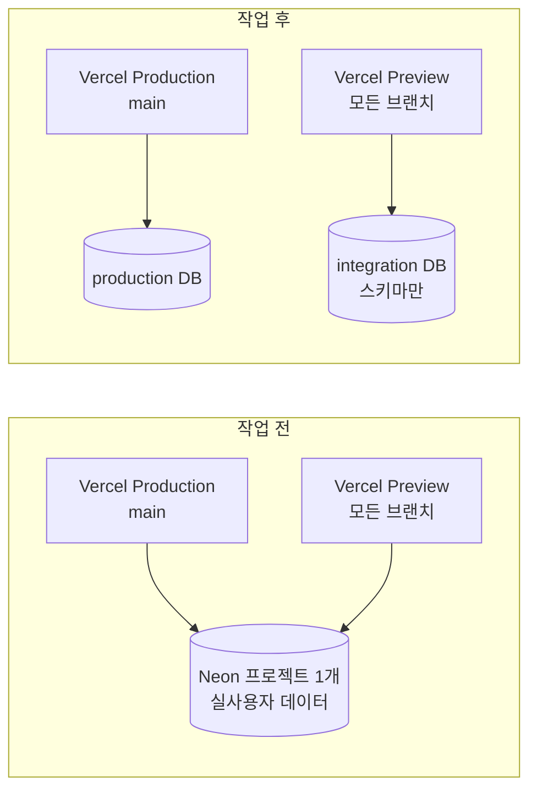

## 문제 상황 — 분리돼 있다고 적혀 있었다

팀 프로젝트에서 백엔드 인프라를 맡았다. 결정 사항은 이미 문서에 있었다.

> DB = Neon PostgreSQL 17, `production` · `integration` 프로젝트 **완전 분리**.
> 앱 runtime은 pooled URL, migration은 direct URL.

내가 할 일은 이 결정을 **실제 환경에 적용하고 검증**하는 것이었다. 결정은 이미 났으니 확인만 하면 되는 작업이라고 생각했다.

콘솔을 열었다. Neon 프로젝트가 **하나**였다.

그리고 Vercel의 `DATABASE_*` 환경 변수 11개가 전부 `Production and Preview`로 잡혀 있었다. 이게 무슨 뜻이냐면,

```
Vercel Production (main)    ┐
                            ├─→ 같은 Neon 프로젝트
Vercel Preview  (모든 브랜치) ┘
```

**preview 배포가 production DB에 쓰고 있었다.** 그 DB에는 실제 사용자의 계정과 세션이 들어 있다.

## 왜 급했나

마침 통합 테스트(E2E)를 시작하려던 참이었다. 로그인하고, 러닝을 시작하고, 종료하고, 회원 탈퇴까지 실행해 보는 시나리오다. **그걸 preview 배포에서 돌리면 production 데이터에 그대로 쓴다.** 탈퇴 시나리오는 데이터를 지우기까지 한다.

테스트를 시작하기 전에 갈라놔야 했고, 이미 사람이 쓰고 있는 서비스라 **멈출 수는 없었다.**

## 초기 가설 — 환경 변수만 바꾸면 되는 줄 알았다

처음 생각은 단순했다. "Preview 쪽 `DATABASE_URL`만 다른 값으로 바꾸면 되는 거 아닌가?"

바꿀 수가 없었다. 그 변수는 내가 만든 게 아니라 **Vercel↔Neon 통합이 관리하는 변수**였다. `···` 메뉴에 `Edit`도 `Reveal`도 없고, `Copy to Clipboard`는 잠겨 있었다.

Vercel 공식 문서가 그 이유를 적어 두고 있다.

> Integrations can automatically add environment variables to your Project Settings.
> For Native Marketplace resources, **the variable scope matches the environments on the project connection.**
>
> — [Vercel Docs, Environment variables](https://vercel.com/docs/environment-variables)

즉 **변수를 직접 고치는 게 아니라, 연결(connection) 쪽의 Environments를 고쳐야 한다.** 손대야 할 지점이 처음 생각과 달랐다.

## 순서가 전부였다

돌아가는 서비스를 갈라내는 작업이라 순서를 먼저 정했다. 새 DB를 먼저 만들고 붙이는 게 아니라, **기존 연결의 범위를 좁히는 것부터** 했다.

| 순서 | 한 일 | 왜 이 순서인가 |
|---|---|---|
| 1 | 기존 Neon 연결의 Environments를 **`Production` 전용**으로 좁힘 | preview가 production DB를 더 못 건드리게 먼저 끊는다 |
| 2 | 같은 연결에서 `Create Database Branch For Deployment`의 **Preview 체크 해제** | 배포할 때마다 production 복제본이 생기는 것을 막는다 |
| 3 | Neon에 **새 프로젝트 생성** (Region `Singapore`, Free) | 이제 preview가 갈 곳을 만든다 |
| 4 | 새 연결을 **`Preview` 전용**으로 붙임 | 범위를 겹치지 않게 |
| 5 | 새 DB에 migration 1회 적용 | 스키마만 만든다. **데이터는 복사하지 않는다** |
| 6 | `develop` preview 재배포 | 새 변수는 **새 배포부터** 적용된다 |

6번이 중요하다. Vercel 문서에 이렇게 적혀 있다.

> Any change you make to environment variables are not applied to previous deployments, **they only apply to new deployments.**

그래서 **이미 떠 있던 preview 배포들은 여전히 옛 변수(= production DB)를 들고 있었다.** 새로 push되면 해소되지만, 그 전까지는 아니다. 이건 고칠 수 있는 게 아니라 알고 있어야 하는 사실이라 기록만 했다.



migration을 적용할 때 하나 걸렸다. 로컬 `.env.local`에는 개발용 값이 들어 있는데, 새 DB에 적용하려면 다른 값을 써야 한다. 셸에서 환경 변수를 주입하고 실행했는데, **셸 env가 `.env.local`보다 우선하는지**가 확실하지 않아서 Node 24에서 먼저 실측하고 진행했다. 우선한다. 확인하지 않고 돌렸으면 엉뚱한 DB에 적용될 수 있었다.

## 값을 볼 수 없는데 pooled인지 어떻게 증명하나

여기가 제일 까다로웠다.

결정 사항에는 「앱 runtime은 pooled, migration은 direct」가 있다. Neon에서 pooled 연결은 호스트에 `-pooler`가 붙는다.

> To enable pooling, **add `-pooler` to your endpoint ID** in the hostname.
> Neon uses PgBouncer in transaction mode (`pool_mode=transaction`).
>
> — [Neon Docs, Connection pooling](https://neon.com/docs/connect/connection-pooling)

그러니까 `DATABASE_URL`의 호스트만 보면 끝나는 문제다. **그런데 값을 볼 수가 없다.** 통합이 관리하는 잠긴 변수라고 위에서 적은 그 변수다.

게다가 보고 싶지도 않았다. 팀 규칙이 「secret 값을 이슈·PR·댓글·터미널에 남기지 않는다. 확인은 **설정됨/미설정**까지만」이었다. 값을 열어서 확인하면 그 뒤로 그 값이 내 터미널 히스토리에 남는다.

**값을 보지 않고 pooled임을 증명해야 했다.**

결국 이렇게 했다. Vercel의 `DATABASE_URL`(Preview) 행에서 `Manage Connection`을 눌러 Neon 연결 패널로 넘어가면, Quickstart의 `.env.local` 탭이 **값을 가린 채** 이런 설명을 붙여 준다.

```
# Recommended for most uses
DATABASE_URL=***********

# For uses requiring a connection without pgbouncer
DATABASE_URL_UNPOOLED=*******************
```

「pgbouncer **없는** 연결이 필요할 때」가 `DATABASE_URL_UNPOOLED` 쪽에만 달려 있다. 뒤집으면 **`DATABASE_URL`이 pgbouncer(pooled) 연결**이라는 뜻이다. 그리고 내가 이 패널에 도달한 경로가 「Vercel의 그 변수 행 → Manage Connection」이므로, **변수 ↔ 프로젝트 ↔ pooled 여부가 한 줄로 이어진다.**

값은 한 글자도 보지 않았다. production과 integration 양쪽에서 같은 문구를 확인했다.

코드 쪽은 원래 확정돼 있었다. runtime은 `DATABASE_URL`을 그대로 쓰고, migration은 direct를 **먼저 집고 pooled면 아예 멈춘다.**

```ts
const direct = process.env.DATABASE_URL_UNPOOLED?.trim();
const fallback = process.env.DATABASE_URL?.trim();
const url = direct || fallback || "";
// ...
if (host.includes("-pooler")) {
  throw new Error("migration 은 direct(unpooled) 접속으로만 실행한다. ...");
}
```

여기서 「경고하고 진행」이 아니라 **throw**인 이유가 있다. PgBouncer transaction mode는 세션 수준 기능을 지원하지 않아서 DDL이 실패하거나 **조용히 이상하게 돌 수 있다.** migration이 반쯤 적용된 상태는 실패보다 훨씬 비싸다. 그럴 바엔 멈추는 게 낫다.

이 코드도 **값을 출력하지 않는다.** 호스트에 `-pooler`가 있는지만 본다.

## 정말 갈라졌나 — canary

설정을 바꿨다고 갈라진 게 아니다. 확인해야 한다.

integration DB에 아무 의미 없는 테이블을 하나 만들고, production에서 같은 이름으로 조회했다.

```sql
-- integration 에서
CREATE TABLE _canary_20260917 (id int);

-- production 에서 (Read-only 토글을 켠 상태로)
SELECT count(*) FROM information_schema.tables
WHERE table_name = '_canary_20260917';
-- 0
```

`0`이었다. 확인 후 지웠다.

migration 이력도 서로 독립이어야 한다. Drizzle은 적용한 migration을 DB 안에 기록한다.

> Upon running migrations Drizzle Kit will persist records about successfully applied migrations in your database. It will store them in migrations log table named `__drizzle_migrations` in `drizzle` schema.
>
> — [Drizzle Docs, drizzle-kit migrate](https://orm.drizzle.team/docs/drizzle-kit-migrate)

production에서 세어 보니 **4**. 저장소의 migration 파일 4개와 맞았다. integration에도 같은 4개를 **따로** 적용했고, 두 DB가 다른 DB라는 건 canary로 이미 확인했으니 이력이 독립이다.

production에서는 **`Read-only` 토글을 켜고 `SELECT`만** 돌렸다. 여기에 DDL을 넣지 않기로 한 방침 그대로다. 그래서 **canary의 반대 방향(production → integration이 안 보이는지)은 확인하지 않았다.** 확인하려면 production에 테이블을 만들어야 하는데, 그건 안 하기로 한 일이다. **미검증으로 남겼다.**

무중단이었는지도 확인했다. 작업 중간중간 production `/login`이 200, OAuth 진입이 302였다. 사용자 쪽에서는 아무 일도 일어나지 않았다.

## 분리했는데, 완전히는 아니었다

여기서 끝난 줄 알았는데 아니었다.

Vercel의 Preview 환경 변수는 **특정 브랜치가 아니라 non-production 브랜치 전체**에 걸린다.

> Preview environment variables are applied to deployments from **any Git branch that does not match the Production Branch.**

우리 결정은 「`develop`만 integration DB」였는데, 실제로는 **모든 feature 브랜치의 preview 배포가 integration DB를 공유**한다. 문서를 더 읽어 보니 브랜치별로 변수를 좁히는 기능 자체는 있다 — 다만 그건 내가 만든 변수 이야기고, **통합이 관리하는 변수는 연결의 Environments를 따른다**(위에 인용한 그 문장). 그래서 브랜치 단위로 좁힐 수 없었다.

더 나쁜 것도 있었다. 다음 날 production 프로젝트를 다시 열어 보니 **Vercel이 만든 `preview/…` 브랜치가 6개 남아 있었다.** 전부 분리 작업을 하던 날짜에 생긴 것이었다.

Neon 브랜치는 부모의 **copy-on-write 복제본**이다. 부모가 production이니까 **6개 전부 실사용자 데이터의 복제본**이었다. 게다가

> When you create a child branch from a protected branch, **new passwords are generated** for the matching Postgres roles on the child branch.
>
> — [Neon Docs, Protected branches](https://neon.com/docs/guides/protected-branches)

이건 **보호된** 브랜치 이야기다. 우리 production은 보호돼 있지 않았다. 그래서 그 비밀번호 재생성이 **일어나지 않았고**, 자식 브랜치가 부모의 자격증명을 그대로 물려받은 상태로 봐야 했다.

그럼 보호를 켜면 되지 않나? **못 켠다.** Neon의 protected branches는 유료 플랜 기능이고(Launch 2개 · Scale 5개), 우리는 Free plan이다. 콘솔에 버튼이 없는 게 아니라 **그 기능이 없다.**

그래서 할 수 있는 것만 했다.

1. **먼저 지금도 생기는지 확인했다.** 그날 preview 배포가 2건 돌았는데 Neon 브랜치는 하나도 생기지 않았다 → **끌 설정이 없다. 이미 안 생긴다.** 분리 작업 중에 생긴 잔여물이었다
2. production에 실데이터가 얼마나 있는지 **개수만** 셌다 (값은 읽지 않았다). 사용자 7명, 세션 14건이었다 → 문제의 크기를 확정했다
3. **자식 브랜치 6개를 삭제했다.** 자식 삭제는 부모에 영향이 없고, 새로 생기지 않는 게 확인됐으니 지우면 끝난다
4. **자격증명 rotate는 하지 않았다.** 노출 범위가 계정 안이고(접속 문자열을 어디에도 붙인 적이 없다), 브랜치를 지우면 함께 사라진다. 반면 rotate는 지금 돌아가는 배포를 끊는다. **다만 "9/17에 접속 문자열을 밖으로 복사한 사실이 나오면 이 판단을 뒤집는다"를 같이 적어 뒀다**

## 고치지 않고 적어 둔 것들

작업하면서 결정과 어긋나는 걸 3개 발견했는데, **그중 하나도 그 자리에서 고치지 않았다.**

| 어긋난 것 | 왜 안 고쳤나 |
|---|---|
| feature 브랜치 preview도 integration DB 공유 | 통합 관리 변수라 브랜치 단위로 못 좁힌다. **구조 문제라 결정을 바꿔야 한다** |
| 기존 preview 배포는 옛 변수를 들고 있음 | 새 배포부터 적용되는 플랫폼 동작. 고칠 대상이 아니다 |
| Neon organization의 Admin 인원 요건 미확인 | 확인 자체를 못 했다. **추정해서 적지 않았다** |

셋 다 「내가 판단할 일이 아니라 팀이 결정을 바꿀 일」이었다. 인프라 작업에서 제일 위험한 게 **혼자 판단해서 설정을 바꿔 놓고 아무도 모르는 상태**라고 생각한다. 그래서 전부 이슈에 적고 넘겼다.

## 결과

| 항목 | 작업 전 | 작업 후 |
|---|---|---|
| Neon 프로젝트 | 1개 (공유) | **2개 (production / integration)** |
| Vercel Production | 그 DB | production DB 전용 |
| Vercel Preview | **같은 DB** | integration DB |
| 격리 확인 | — | canary `0` |
| migration 이력 | 공유 | 각 4개, 독립 |
| production 중단 | — | **없음** (`/login` 200 유지) |
| production 데이터 복제 | — | **안 함** (integration은 스키마만) |

E2E 테스트를 막고 있던 blocker가 사라졌다. 같은 날 integration에서 실제 로그인이 성공했고, 로그인은 `users` · `oauth_accounts` · `auth_sessions`에 쓰기를 발생시키니까 **그 쓰기가 production이 아니라 integration으로 갔다는 것까지 실사용으로 확인**됐다.

## 배운 점

**문서에 적힌 결정과 콘솔의 실제 상태는 다를 수 있다.** 이번 건은 결정이 잘못된 게 아니라 **적용이 안 돼 있었다.** "정했으니 돼 있겠지"가 제일 위험했다. 콘솔을 열어 보는 것으로 끝나는 확인이었고, 안 했으면 실데이터를 테스트로 덮어썼을 것이다.

**값을 보지 않고도 증명할 방법이 대체로 있다.** 처음엔 "값을 못 보는데 어떻게 확인해?"에서 막혔는데, 결국 UI 문구 하나로 이어 붙일 수 있었다. 확인하려고 secret을 열어 보는 건 편하지만, 그 순간 그 값은 내 히스토리에 남는다.

**"안 고치고 적어 두기"도 작업이다.** 어긋난 3건을 그 자리에서 고쳤으면 더 빨랐겠지만, 그건 결정을 혼자 바꾸는 일이었다. 기록으로 남기니까 나중에 그중 하나(preview 브랜치 잔여물)가 실제 위험으로 드러났을 때 **이미 맥락이 다 적혀 있어서** 바로 처리할 수 있었다.

**"확인 안 함"과 "문제 없음"은 다르다.** canary 반대 방향, Admin 인원, 당시 preview가 실제로 어느 DB를 봤는지 — 확인 못 한 것들은 전부 `미검증`이라고 썼다. 나중에 이걸 읽는 사람(=미래의 나)이 "확인됐다"로 오해하지 않는 게 더 중요했다.

## 더 보면 좋은 것

- **connection pooling (PgBouncer transaction mode)** — 왜 pooled로 DDL을 돌리면 안 되는지. 이번엔 "안 된다"만 알고 막았는데, 세션 수준 기능이 왜 안 되는지까지 알면 다음엔 더 빨리 판단할 수 있다
- **copy-on-write 브랜칭** — Neon 브랜치가 왜 즉시 생기고 왜 부모 데이터를 그대로 담는지. 브랜치를 "가벼운 복사본"으로만 알면 이번 같은 사고를 놓친다
- **forward-only migration과 복구 전략** — 되돌리는 수단이 migration에 없을 때 무엇에 기대야 하는지. 이 프로젝트는 Free plan 자동 복구 window가 6시간이라, 적용 전에 직접 snapshot을 만드는 것을 전제로 절차를 다시 썼다

## 참고 자료

- [Neon Docs — Connection pooling](https://neon.com/docs/connect/connection-pooling)
- [Neon Docs — Protected branches](https://neon.com/docs/guides/protected-branches)
- [Vercel Docs — Environment variables](https://vercel.com/docs/environment-variables)
- [Drizzle Docs — drizzle-kit migrate](https://orm.drizzle.team/docs/drizzle-kit-migrate)
