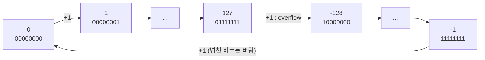
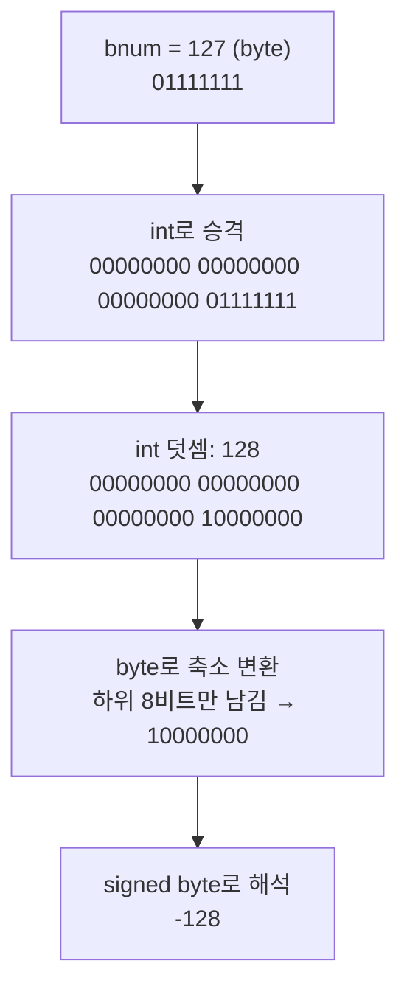

## 들어가며

수업이 끝날 때 강사님이 "오늘 생각해보면 좋은 키워드"라며 코드 세 줄을 주셨다.

```java
byte bnum = 127;
bnum++;
System.out.println(bnum);
```

> 위 식을 실행했을 때 예상 값은 127 + 1 이기 때문에 128이 나와야 하지만 실제 값은 다르게 나온다.
> 위 내용이 왜 이렇게 되는지 생각해보고 설명해보자.
> 포함되어야 하는 내용: **byte, bit, overflow, underflow, type casting**

실행해보면 `-128`이 나온다. "byte는 127까지라서 넘치면 이상해진다"까지는 말할 수 있었지만, **왜 하필 -128인지**는 설명하지 못했다. 이 글은 그걸 설명할 수 있게 되기까지의 과정이다.

## 문제 상황

풀면서 막힌 지점은 세 군데였다.

| # | 처음 생각 | 왜 막혔나 |
|---|-----------|-----------|
| 1 | 정수 범위는 **프로그래밍 언어마다** 정해져 있다 | 그러면 -128이라는 숫자가 어디서 나오는지 설명할 수 없다 |
| 2 | 양수가 127까지면 음수도 **-127까지**일 것이다 | 그런데 실제로 튀어나온 값은 -128이다 |
| 3 | 127 → -128로 넘어가는 +1은 **2의 보수를 만들 때 더하는 +1**과 관련이 있다 | 둘이 섞여서 어떤 +1이 무슨 일을 하는지 헷갈렸다 |

강사님이 요구한 다섯 키워드(byte, bit, overflow, underflow, type casting)를 모두 엮어서 설명하는 것도 과제였다.

## 해결 과정

### 1. 범위는 언어가 아니라 비트 수가 정한다

첫 번째 착각부터 걷어냈다. Java 명세는 `byte`를 이렇게 정의한다.

> The integral types are `byte`, `short`, `int`, and `long`, whose values are 8-bit, 16-bit, 32-bit and 64-bit signed two's-complement integers, respectively
> — [JLS §4.2](https://docs.oracle.com/javase/specs/jls/se21/html/jls-4.html#jls-4.2)

범위를 정하는 건 세 가지다.

- **몇 비트를 쓰는가**: `byte`는 8비트
- **음수를 쓰는가(signed/unsigned)**: `byte`는 signed
- **음수를 비트로 어떻게 표현하는가**: 2의 보수(two's complement)

언어는 이 셋을 고를 뿐이고, 범위는 그 선택에서 계산으로 나온다. 8비트가 만들 수 있는 비트 패턴은 `00000000`부터 `11111111`까지 **2⁸ = 256개**다. 이 256개를 전부 0 이상에 쓰면 unsigned로 0~255가 되고, 절반을 음수에 나눠주면 signed가 된다.

### 2. 왜 -127이 아니라 -128인가

두 번째 착각은 "대칭일 것"이라는 생각이었다. 직접 세어보니 바로 틀린 게 보였다.

```text
음수  -127 ~ -1   → 127개
0                 →   1개
양수     1 ~ 127  → 127개
                  --------
                    255개
```

패턴은 256개인데 255개밖에 안 쓴다. **하나가 남는다.** 이 남는 하나를 어디에 쓰느냐가 표현 방식의 차이다.

| 항목 | 부호-크기 (sign-magnitude) | 2의 보수 (two's complement) |
|------|---------------------------|----------------------------|
| 맨 앞 비트의 의미 | 부호만 표시 (0 = +, 1 = -) | **-128의 가중치** |
| `10000000` | -0 | -128 |
| 0의 개수 | 2개 (+0, -0) | 1개 |
| 8비트 범위 | -127 ~ 127 | **-128 ~ 127** |
| 덧셈 회로 | 부호를 따로 처리해야 함 | 양수·음수 모두 같은 덧셈 회로 |

2의 보수에서는 +0과 -0을 따로 두지 않는다. 그래서 남는 패턴 `10000000`을 -128에 준다. 음수 쪽이 하나 더 많은 건 **0이 양수 쪽 패턴 하나를 차지하기 때문**이다.

맨 앞 비트를 "부호 표시"가 아니라 **-128이라는 가중치를 가진 자리**로 보니 계산이 깔끔해졌다.

```text
비트 자리:  -128  64  32  16   8   4   2   1

01111111 =   0 + 64 + 32 + 16 + 8 + 4 + 2 + 1 =  127
10000000 = -128                               = -128
11111111 = -128 + 64 + 32 + 16 + 8 + 4 + 2 + 1 =  -1
```

일반화하면 n비트 signed 정수의 범위는 **-2ⁿ⁻¹ ~ 2ⁿ⁻¹ - 1**이다. 명세에 적힌 byte 범위도 "from -128 to 127, inclusive"다. ([JLS §4.2.1](https://docs.oracle.com/javase/specs/jls/se21/html/jls-4.html#jls-4.2.1))

### 3. 127 + 1을 비트로 더해보면 (overflow)

이제 문제의 덧셈을 비트로 직접 해봤다.

```text
  01111111   (127)
+ 00000001   (  1)
-----------
  10000000
```

결과 `10000000`을 unsigned로 읽으면 128, signed로 읽으면 -128이다. CPU는 "127에서 -128로 넘어간다"는 걸 모른다. **그냥 이진수 덧셈을 했을 뿐이고, 결과 비트를 signed로 해석하니 -128이 된 것**이다.

이렇게 표현 가능한 최댓값을 넘어가는 걸 **overflow**라고 한다. Java는 이때 예외를 던지지 않는다.

> The integer operators do not indicate overflow or underflow in any way.
> — [JLS §4.2.2](https://docs.oracle.com/javase/specs/jls/se21/html/jls-4.html#jls-4.2.2)

그래서 byte의 값은 직선이 아니라 **원형**으로 이어진다고 생각하면 이해가 쉽다.



### 4. 반대 방향: -128 - 1 (underflow)

원형이면 반대로도 돌아야 한다. 최솟값 -128에서 1을 빼봤다.

```text
  10000000   (-128)
- 00000001   (   1)
-----------
  01111111   ( 127)
```

최솟값 아래로 내려가면 최댓값 127로 돌아온다. 강사님이 말한 **underflow**가 이 방향이다. (부동소수점에서 underflow는 "0에 너무 가까워서 표현하지 못하는 경우"를 가리키는 다른 개념이라 구분해둘 필요가 있다. 이건 아래 학습 개념에 적어뒀다.)

### 5. 헷갈렸던 두 개의 +1

세 번째 착각이 가장 오래 걸렸다. 2의 보수를 배울 때 "비트를 뒤집고 +1"을 먼저 봤기 때문에, 127 → -128의 +1도 그것과 관련이 있다고 생각했다. 나란히 놓고 보니 전혀 다른 이야기였다.

| | ① 127 + 1 | ② -5 만들기 |
|---|-----------|-------------|
| 정체 | 실제 **산술 덧셈** | 음수 표현을 만드는 **변환 규칙** |
| 과정 | `01111111 + 00000001` | `00000101` → 반전 `11111010` → +1 |
| 결과 | `10000000` | `11111011` |
| 의미 | 결과를 signed로 읽으니 -128 | 이 비트가 -5를 뜻한다 |

①은 "계산"이고 ②는 "표기법"이다. 둘 다 +1이 나와서 섞였을 뿐, 127이 -128이 되는 데 ②는 전혀 관여하지 않는다.

그럼 왜 굳이 이런 표기법을 쓸까? ②의 규칙으로 음수를 만들어두면 **①의 덧셈 회로 하나로 음수 계산까지 맞게 떨어지기 때문**이다.

```text
  11111111   (-1)          11111110   (-2)
+ 00000001   ( 1)        + 00000001   ( 1)
-----------              -----------
1 00000000   ( 0)          11111111   (-1)
↑ 8비트를 넘친 1은 버린다
```

뺄셈 회로를 따로 만들 필요 없이 덧셈만으로 `-1 + 1 = 0`, `-2 + 1 = -1`이 성립한다. 이게 2의 보수를 쓰는 이유다.

### 6. 그런데 bnum++ 안에는 형변환이 숨어 있다 (type casting)

여기까지 정리하고 나서 키워드 중 **type casting**이 남았다. 코드 어디에도 `(byte)`가 없는데 왜 형변환이 필요할까?

확인해보려고 `bnum++`을 `bnum = bnum + 1`로 바꿔봤더니 **컴파일이 안 됐다.**

```text
error: incompatible types: possible lossy conversion from int to byte
        b = b + 1;
              ^
```

`bnum + 1`의 결과는 `byte`가 아니라 `int`였다. Java는 `byte`끼리 더하지 않고, 덧셈 전에 **int로 승격(binary numeric promotion)**한 다음 계산한다. 그러면 `bnum++`은 왜 컴파일이 될까? 명세를 찾아보니 [후위 증가 연산자(§15.14.2)](https://docs.oracle.com/javase/specs/jls/se21/html/jls-15.html#jls-15.14.2)는 int로 승격해서 더한 다음, 저장하기 전에 **원래 타입으로 축소 변환(narrowing primitive conversion)**까지 해준다고 적혀 있다. `+=` 같은 복합 대입 연산자도 마찬가지다.

> A compound assignment expression of the form `E1 op= E2` is equivalent to `E1 = (T)((E1) op (E2))`, where `T` is the type of `E1`
> — [JLS §15.26.2](https://docs.oracle.com/javase/specs/jls/se21/html/jls-15.html#jls-15.26.2)

| 코드 | 컴파일 | 실제로 일어나는 일 |
|------|--------|-------------------|
| `bnum = bnum + 1;` | ❌ 에러 | int 결과를 byte에 넣으려 해서 막힘 |
| `bnum = (byte)(bnum + 1);` | ✅ | 개발자가 직접 캐스팅 |
| `bnum += 1;` | ✅ | `(byte)(bnum + 1)`이 자동으로 들어감 |
| `bnum++;` | ✅ | 승격 → 덧셈 → byte로 축소 변환 |

그럼 int 128을 byte로 줄일 때 무슨 일이 일어나는가. 명세는 이렇게 말한다.

> A narrowing conversion of a signed integer to an integral type T simply discards all but the n lowest order bits, where n is the number of bits used to represent type T. In addition to a possible loss of information about the magnitude of the numeric value, this may cause the sign of the resulting value to differ from the sign of the input value.
> — [JLS §5.1.3](https://docs.oracle.com/javase/specs/jls/se21/html/jls-5.html#jls-5.1.3)

**하위 8비트만 남기고 나머지는 버린다.** 부호가 바뀔 수도 있다고 명세에 적혀 있다. 그러니까 `bnum++`의 실제 흐름은 이렇다.



int 안에서는 128이 문제없이 계산된다. overflow가 드러나는 건 **byte로 되돌리면서 위쪽 비트를 버리는 순간**이다. 3번에서 8비트 덧셈으로 설명한 것과 결과는 같지만, Java에서 실제로 일어나는 일은 이쪽이 더 정확하다.

### 7. 직접 확인

아래는 위 설명이 맞는지 확인하려고 작성한 예시 코드다. 강사님 코드에 몇 줄을 덧붙였다.

```java
byte bnum = 127;
bnum++;
System.out.println(bnum);                         // -128  (overflow)

byte low = -128;
low--;
System.out.println(low);                          // 127   (underflow)

int wide = 127 + 1;
System.out.println(wide);                         // 128   (int 안에서는 정상)
System.out.println((byte) wide);                  // -128  (하위 8비트만 남김)
System.out.println(Integer.toBinaryString(wide)); // 10000000
System.out.println((byte) 0b11111111);            // -1
System.out.println(Byte.toUnsignedInt(bnum));     // 128   (같은 비트를 unsigned로 읽음)
```

JDK 21에서 실행한 결과가 주석과 같았다. 마지막 줄이 특히 좋았다. **같은 `10000000`이 signed로는 -128, unsigned로는 128**이라는 걸 코드로 확인할 수 있다.

## 결과

강사님 질문에 대한 답을 이제 한 문단으로 할 수 있다.

> `byte`는 8비트 signed 정수라서 2의 보수로 -128~127을 표현합니다. `bnum++`은 내부적으로 bnum을 int로 승격해 1을 더하고, 결과 128을 다시 byte로 축소 변환합니다. 이때 하위 8비트 `10000000`만 남는데, 2의 보수에서 이 비트는 -128입니다. 최댓값을 넘어 최솟값으로 돌아가는 overflow이고, 반대로 -128에서 1을 빼면 127이 되는 underflow가 일어납니다. Java는 정수 overflow를 예외로 알려주지 않습니다.

### 면접 답변 Before / After

**"byte 127에 1을 더하면 왜 -128인가요?"**라는 질문을 받았다고 가정했다.

| | Before | After |
|---|--------|-------|
| 범위의 근거 | "Java에서 byte는 -128~127로 정해져 있어서요" | "8비트 = 256개 패턴을 2의 보수로 나누면 -128~127이 됩니다" |
| 왜 -128인가 | "넘치면 반대쪽으로 가서요" | "127 + 1의 결과 비트 `10000000`이 2의 보수에서 -128이기 때문입니다" |
| 왜 비대칭인가 | 설명 못 함 | "0이 하나라서 -0 자리가 남고, 그 패턴을 -128에 씁니다" |
| 형변환 | 언급 안 함 | "`++`이 int로 승격 후 byte로 축소 변환하면서 하위 8비트만 남깁니다" |
| 꼬리질문 대비 | 없음 | 두 개의 +1 구분, `bnum = bnum + 1`이 컴파일 에러인 이유 |

### 배운 점

- **값은 비트 패턴의 해석이다.** `10000000`은 그 자체로 128도 -128도 아니고, 타입이 해석을 정한다.
- **"+1"처럼 같은 기호가 다른 맥락에서 나오면 따로 떼어서 보자.** 헷갈림의 원인은 대부분 이런 겹침이었다.
- **코드에 안 보이는 변환이 있다.** `bnum++` 한 줄 안에 승격과 축소 변환이 숨어 있었고, `bnum = bnum + 1`로 바꿔본 게 그걸 찾는 계기가 됐다.

## 더 학습하면 좋은 개념

- **`Math.addExact` / `Math.incrementExact`**: overflow가 나면 `ArithmeticException`을 던지는 메서드. Java가 overflow를 조용히 넘긴다는 걸 알았으니, 조용히 넘기면 안 되는 계산(금액, 수량)에서 어떻게 막는지가 다음 단계다.
- **Binary Numeric Promotion (JLS §5.6)**: `byte + byte`가 왜 `int`가 되는지를 정한 규칙. `short`, `char` 연산에서도 같은 일이 일어나서 형변환 에러의 원인을 이해하는 데 필요하다.
- **`char`는 16비트 unsigned**: Java의 정수형 중 유일하게 음수가 없다. 같은 비트 수라도 signed/unsigned에 따라 범위가 어떻게 달라지는지 비교해보기 좋다.
- **부동소수점(IEEE 754)의 overflow와 underflow**: `float`, `double`에서 overflow는 `Infinity`가 되고, underflow는 0에 너무 가까운 값을 표현하지 못하는 걸 뜻한다. 정수의 wrap-around와 이름은 같지만 동작이 다르다.
- **C/C++의 signed overflow**: Java는 wrap-around가 명세로 정해져 있지만, C/C++에서 signed 정수 overflow는 정의되지 않은 동작(undefined behavior)이다. "CPU는 그냥 비트를 더할 뿐"이 언어 차원에서도 항상 보장되는 건 아니라는 걸 알 수 있다.

## 참고 자료

- [JLS §4.2 Primitive Types and Values](https://docs.oracle.com/javase/specs/jls/se21/html/jls-4.html#jls-4.2)
- [JLS §4.2.2 Integer Operations](https://docs.oracle.com/javase/specs/jls/se21/html/jls-4.html#jls-4.2.2)
- [JLS §5.1.3 Narrowing Primitive Conversion](https://docs.oracle.com/javase/specs/jls/se21/html/jls-5.html#jls-5.1.3)
- [JLS §5.6 Numeric Contexts](https://docs.oracle.com/javase/specs/jls/se21/html/jls-5.html#jls-5.6)
- [JLS §15.14.2 Postfix Increment Operator ++](https://docs.oracle.com/javase/specs/jls/se21/html/jls-15.html#jls-15.14.2)
- [JLS §15.26.2 Compound Assignment Operators](https://docs.oracle.com/javase/specs/jls/se21/html/jls-15.html#jls-15.26.2)
- [Java SE 21 API - Math.addExact](https://docs.oracle.com/en/java/javase/21/docs/api/java.base/java/lang/Math.html#addExact(int,int))
- [Java SE 21 API - Byte.toUnsignedInt](https://docs.oracle.com/en/java/javase/21/docs/api/java.base/java/lang/Byte.html#toUnsignedInt(byte))
