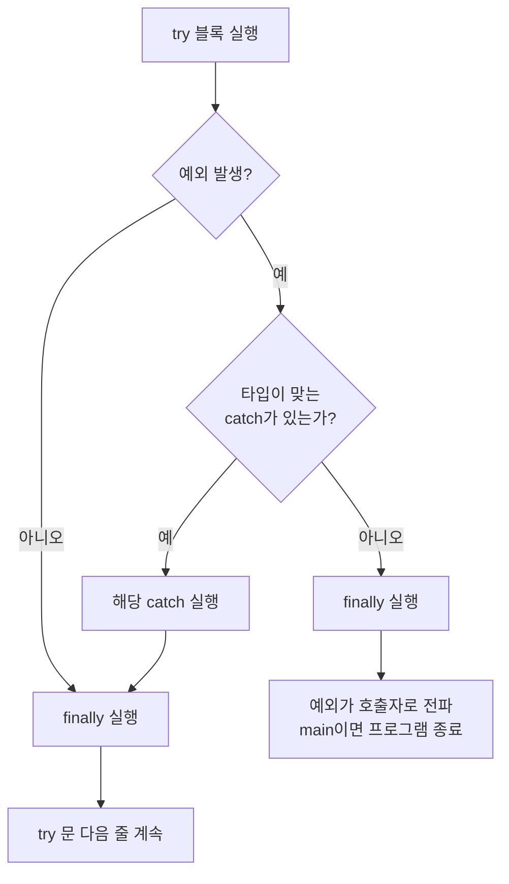
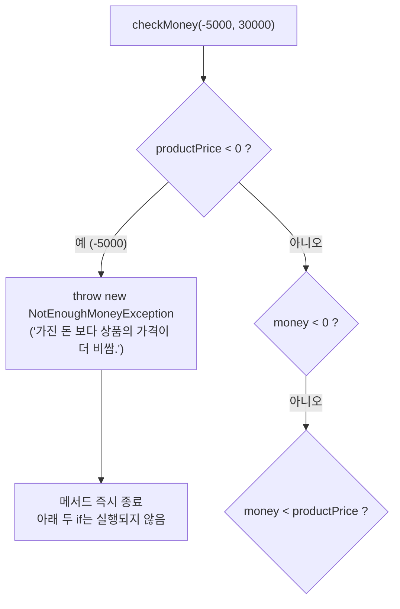
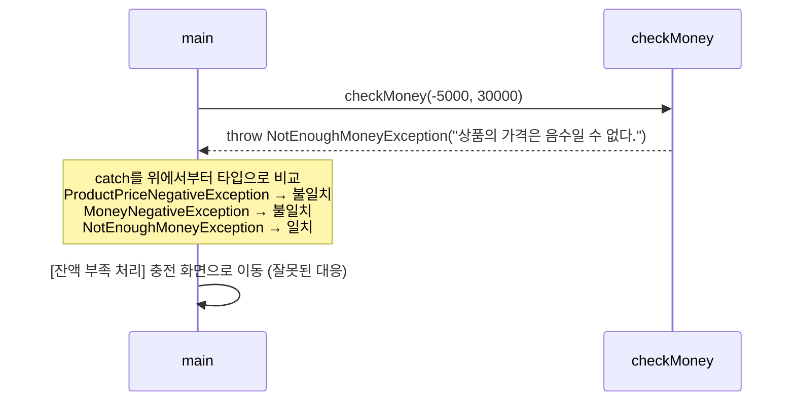
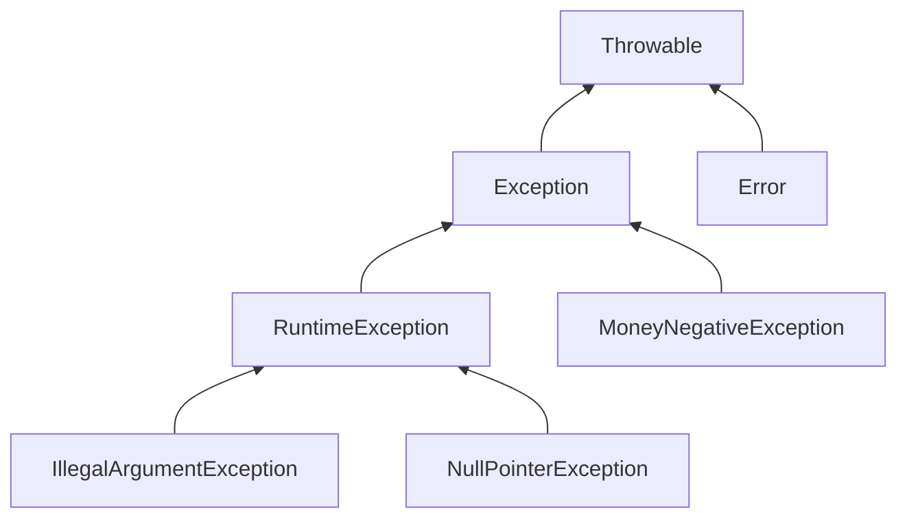

## 들어가며

부트캠프에서 Java 예외 처리를 배웠다. 수업은 세 단계로 진행됐다.

| 단계 | 예제 | 다룬 내용 |
|------|------|-----------|
| 1 | `a_basic` | 예외를 처리하지 않으면 프로그램이 어떻게 죽는가 |
| 2 | `b_solved` | `try-catch-finally`, `throw` |
| 3 | `c_userexception` | `Exception`을 상속한 사용자 정의 예외 |

예제는 전부 잘 돌아갔다. 그런데 **겉으로 보기에만 만족하고 싶지는 않았다.** 출력이 맞게 나온다고 해서 내가 동작을 이해했다는 보장은 없으니까. 그래서 3단계의 사용자 정의 예외 코드를 일부러 망가뜨려 보기로 했다. checked와 unchecked 구분은 수업 뒤 팀원들과 자습하면서 더 깊게 파고들었다.

## 문제 상황

3단계 예제는 상품 가격(`productPrice`)과 가진 돈(`money`)을 검사해서 상황마다 다른 예외를 던진다. 나는 **조건, 예외 클래스, 메시지의 짝을 일부러 엇갈리게** 바꿔 놓았다. 아래는 실제로 바꿔 둔 내 코드다.

```java
public void checkMoney(int productPrice, int money)
        throws MoneyNegativeException, ProductPriceNegativeException, NotEnoughMoneyException {
    // 상품 가격 음수
    if (productPrice < 0) {
        throw new NotEnoughMoneyException("가진 돈 보다 상품의 가격이 더 비쌈.");
    }
    // 내가 가진 돈 음수
    if (money < 0) {
        throw new MoneyNegativeException("가진 돈이 음수일 수 없다.");
    }
    // 상품 가격이 내가 가진 돈 보다 클 때
    if (money < productPrice) {
        throw new ProductPriceNegativeException("상품의 가격은 음수일 수 없다.");
    }
}
```

`main`에서는 `checkMoney(-5000, 30000)`을 호출하고, 예외 클래스마다 catch 블록을 하나씩 두었다. 여기서 답해야 할 질문은 세 가지였다.

| # | 질문 | 처음 생각 |
|---|------|-----------|
| 1 | 가격이 -5000이면 무엇이 출력되는가? | "상품의 가격은 음수일 수 없다."가 나올 것이다 |
| 2 | 메시지만 조건에 맞게 고치면 해결되는가? | 출력이 맞으면 된 것 아닌가? |
| 3 | 왜 `checkMoney`에는 `throws`가 있고 `checkAge`에는 없는가? | 컴파일 때 알 수 있는 에러면 checked, 실행해야 알 수 있으면 unchecked |

세 개 모두 처음 생각이 틀렸거나 반쪽짜리였다. 그 전에, 예외가 어떻게 흘러가는지부터 1·2단계 예제로 다시 확인했다.

## 해결 과정

### 1. 예외를 처리하지 않으면 그 자리에서 끝난다

1단계 예제는 `null`인 문자열의 `length()`를 호출한다.

```java
System.out.println("프로그램 시작 ...");
String str = null;
str.length();
System.out.println("프로그램 종료 ...");
```

```text
프로그램 시작 ...
Exception in thread "main" java.lang.NullPointerException: Cannot invoke "String.length()" because "str" is null
	at com.wanted.a_exception.a_basic.Application.main(Application.java:20)
```

**"프로그램 종료 ..."가 출력되지 않았다.** 예외가 발생한 줄에서 `main`이 비정상 종료됐기 때문이다. 마지막 줄의 `at ... (Application.java:20)`은 스택 트레이스(예외가 지나온 호출 경로)로, 어디서 터졌는지 알려준다.

수업 코드 주석에는 컴파일 오류(없는 변수 참조, 타입 불일치)와 런타임 오류(NPE)를 구분해 두었다. 이 구분이 뒤에서 checked/unchecked와 섞이는 원인이 된다.

### 2. try-catch-finally: 흐름이 어디로 튀는가

2단계 예제에는 주석 처리된 코드가 있었다. `try` 안에 예외를 두 개 넣고 catch는 `ArithmeticException` 하나만 둔 코드다. **두 줄의 순서만 바꿔서** 둘 다 실행해 봤다.

```java
try {
    int result = 10 / 0;     // ArithmeticException
    String str = null;
    str.length();            // NullPointerException
} catch (ArithmeticException e) {
    System.out.println("예외 메세지 = " + e.getMessage());
} finally {
    System.out.println("예외 발생 여부와 관계 없이 실행됨...");
}
System.out.println(" 프로그램 종료됨...");
```

| | A. `10 / 0`이 먼저 | B. `str.length()`가 먼저 |
|---|---|---|
| 처음 발생한 예외 | `ArithmeticException` | `NullPointerException` |
| 맞는 catch가 있는가 | 있음 | **없음** |
| finally | 실행됨 | 실행됨 |
| "프로그램 종료됨" | 출력됨 | **출력 안 됨** |

```text
// A
 프로그램 시작됨...
예외 메세지 = / by zero
예외 발생 여부와 관계 없이 실행됨...
 프로그램 종료됨...

// B
 프로그램 시작됨...
예외 발생 여부와 관계 없이 실행됨...
Exception in thread "main" java.lang.NullPointerException: Cannot invoke "String.length()" because "str" is null
```

여기서 세 가지를 확인했다.

- `try` 블록은 **첫 번째 예외에서 멈춘다.** A에서 `str.length()`는 실행조차 되지 않았다.
- catch는 던져진 예외의 **타입이 맞을 때만** 잡는다. B의 NPE는 `ArithmeticException` catch를 그냥 지나쳤다.
- finally는 예외를 못 잡은 B에서도 실행됐다. 다만 그 뒤에 예외가 다시 밖으로 나가서 프로그램은 결국 죽었다.



참고로 2단계 예제의 실제 코드는 `catch (Exception e)`로 모든 예외를 한 번에 받는다. 편하지만, 4번의 실험을 해보고 나서 이 방식이 왜 위험한지 알게 됐다.

### 3. throw와 throws는 다른 일을 한다

2단계의 `checkAge`는 나이가 음수면 예외를 던진다.

```java
public static void checkAge(int age) {
    if (age < 0) {
        throw new IllegalArgumentException("dz");
    }
    System.out.println("전달 받은 " + age + "는 유요한 나이다.");
}
```

수업 때 적은 주석에는 "throw는 호출한 쪽에 예외처리를 위임한다"라고 되어 있었다. 정리하면서 보니 `throw`와 `throws`가 섞여 있었다.

| | `throw` | `throws` |
|---|---------|----------|
| 위치 | 메서드 **본문** 안 | 메서드 **선언부** |
| 하는 일 | 예외 객체를 실제로 **발생**시킴 | "이 메서드는 이 예외를 던질 수 있다"고 **선언**함 |
| 예 | `throw new IllegalArgumentException(...)` | `void checkMoney(...) throws MoneyNegativeException` |

예외를 발생시키는 건 `throw`이고, 처리를 호출한 쪽에 넘기겠다고 **알리는** 건 `throws`다. 이 구분을 해두니 "예외가 **발생**했다"와 "예외를 **처리**했다"도 나눠서 말할 수 있게 됐다. 처리는 호출한 쪽의 catch에서 일어난다.

### 4. 일부러 엇갈린 예외: 예상과 다른 출력

이제 망가뜨려 둔 3단계 코드를 실행했다. 처음에는 가격이 -5000이니 당연히 "상품의 가격은 음수일 수 없다."가 나왔다고 생각했다. 그런데 다시 돌려 보니 실제 출력은 달랐다.

```text
가진 돈 보다 상품의 가격이 더 비쌈.
```

**예상한 결과를 확인한 결과처럼 말하고 있었다.** "겉으로만 만족하지 않겠다"고 시작한 실험에서 정작 콘솔을 제대로 안 본 셈이다.

원인은 `if` 문이 위에서부터 차례로 검사된다는 데 있었다.



첫 번째 조건 `productPrice < 0`이 참이라 거기서 `NotEnoughMoneyException`이 **발생**했고, 메서드는 바로 끝났다. 그다음 `main`의 `catch (NotEnoughMoneyException e)` 블록이 그 예외를 **처리**하면서 메시지를 출력했다. 조건은 "가격 음수"인데 클래스와 메시지는 "잔액 부족"이니 출력이 엉뚱할 수밖에 없다.

### 5. 메시지만 고치면 될까?

해결책으로 처음 떠올린 건 메시지를 조건에 맞게 바꾸는 것이었다. 그러면 출력은 맞게 나온다. 그런데 클래스까지 바꿔야 한다는 건 느낌으로는 알겠는데, **왜 그래야 하는지는 설명하지 못했다.**

설명이 안 되는 건 눈으로 본 적이 없어서라고 생각하고, catch 블록마다 **하는 일을 다르게** 바꿔서 확인했다. 실무라면 상황마다 대응이 다를 테니까. 아래는 실험용으로 작성한 예시 코드다.

```java
} catch (ProductPriceNegativeException e) {
    System.out.println("[가격 오류 처리] 상품 등록 화면으로 돌아갑니다 → " + e.getMessage());
} catch (MoneyNegativeException e) {
    System.out.println("[입력 오류 처리] 금액을 다시 입력받습니다 → " + e.getMessage());
} catch (NotEnoughMoneyException e) {
    System.out.println("[잔액 부족 처리] 충전 화면으로 이동합니다 → " + e.getMessage());
}
```

그리고 클래스는 엇갈린 채로 두고 **메시지만** 조건에 맞게 고쳐서 `checkMoney(-5000, 30000)`을 실행했다.

```text
[잔액 부족 처리] 충전 화면으로 이동합니다 → 상품의 가격은 음수일 수 없다.
```

메시지는 맞다. 하지만 가격이 음수라는 **입력 오류**인데 프로그램은 **충전 화면으로 보냈다.** 원래 catch 블록처럼 메시지만 출력하는 코드였다면 이 버그는 콘솔에서 보이지도 않았을 것이다.

이유는 Java 명세에 그대로 적혀 있다.

> A catch clause is selected to handle the thrown value if the type of the thrown value is assignment compatible with the type of the parameter of the catch clause, and the catch clause is the first (leftmost) catch clause of the try statement whose catch type can handle the thrown value.
> — [JLS §14.20.1](https://docs.oracle.com/javase/specs/jls/se21/html/jls-14.html#jls-14.20.1)

catch 블록은 **던져진 값의 타입**으로 고른다. 메시지 문자열은 선택에 아무 영향을 주지 않는다.



그래서 내 답은 이렇게 정리됐다.

> catch 블록은 메시지가 아니라 **예외 클래스 타입**을 보고 선택된다. 클래스가 엇갈리면 메시지가 맞더라도 다른 catch 블록이 실행되어 엉뚱한 처리를 하게 된다.

메시지는 **사람이** 읽는 설명이다. 사용자는 메시지를 보고 무엇이 잘못됐는지 알고, 개발자는 예외 클래스 이름과 스택 트레이스를 보고 어디를 고칠지 안다. 반면 클래스 타입은 **프로그램이** 분기하는 기준이다. 둘 다 조건과 짝이 맞아야 한다. 2번에서 본 `catch (Exception e)`처럼 전부 한 블록으로 받으면 이 차이가 아예 묻혀 버린다.

### 6. throws를 지우면? checked와 unchecked의 진짜 기준

남은 질문은 `throws`였다. `checkMoney` 선언에서 `throws ...`를 지우고 컴파일해 봤다.

```text
error: unreported exception ProductPriceNegativeException; must be caught or declared to be thrown
error: unreported exception MoneyNegativeException; must be caught or declared to be thrown
error: unreported exception NotEnoughMoneyException; must be caught or declared to be thrown
```

반면 `checkAge`는 `throws` 없이도 컴파일된다. 처음에는 이렇게 설명했다.

> 컴파일 시점에 확인할 수 있으면 checked, 실행해야만 알 수 있으면 unchecked.

그런데 내가 만든 `MoneyNegativeException`이 반례였다. 이 예외는 `money < 0`이 참이 되는 **실행 중에** 발생한다. 컴파일할 때는 돈이 음수일지 알 수 없다. 그런데도 checked다. 1번 주석의 "컴파일 오류 vs 런타임 오류"는 **오류**를 나누는 기준이었고, checked/unchecked는 **예외 클래스**를 나누는 기준이라 서로 다른 이야기였다.

**checked든 unchecked든 예외는 전부 실행 중에 발생한다.** 컴파일러가 검사하는 건 예외가 날지 말지가 아니라, 그 예외를 **잡거나 선언했는지**다. Oracle 튜토리얼은 이걸 Catch or Specify Requirement라고 부른다.

> Code that fails to honor the Catch or Specify Requirement will not compile.
> — [The Java Tutorials - The Catch or Specify Requirement](https://docs.oracle.com/javase/tutorial/essential/exceptions/catchOrDeclare.html)

그럼 진짜 기준은 무엇일까. 팀원들과 자습하면서 IntelliJ에서 두 예외 클래스를 Ctrl+클릭해 `extends`를 끝까지 따라 올라가 봤다.



`IllegalArgumentException`은 `RuntimeException`을 **거쳐서** `Exception`에 닿는다. 내 `MoneyNegativeException`은 `RuntimeException`을 **건너뛰고** 바로 `Exception`을 상속한다. 갈라지는 지점이 `RuntimeException`이었다. 명세의 정의도 같다.

> The unchecked exception classes are the run-time exception classes and the error classes.
> — [JLS §11.1.1](https://docs.oracle.com/javase/specs/jls/se21/html/jls-11.html#jls-11.1.1)

| 구분 | 상속 기준 | 컴파일러 검사 | 예시 |
|------|-----------|---------------|------|
| checked | `Exception` 계열이면서 `RuntimeException`은 아님 | catch 또는 throws **강제** | `MoneyNegativeException`, `FileNotFoundException` |
| unchecked | `RuntimeException` 또는 `Error` 계열 | 강제하지 않음 | `IllegalArgumentException`, `NullPointerException` |

"실행해야 알 수 있느냐"라는 모호한 기준을 **클래스 족보**라는, 직접 확인할 수 있는 기준으로 바꾼 것이 이번 자습에서 얻은 가장 큰 수확이었다. 덧붙이면 unchecked에도 `throws`를 붙일 수는 있다. 필요 없는 게 아니라 **강제되지 않는** 것이다.

## 결과

엇갈린 코드를 클래스와 메시지 모두 조건에 맞게 고쳤다.

| 조건 | 예외 클래스 | 메시지 |
|------|-------------|--------|
| `productPrice < 0` | `ProductPriceNegativeException` | 상품의 가격은 음수일 수 없다. |
| `money < 0` | `MoneyNegativeException` | 가진 돈이 음수일 수 없다. |
| `money < productPrice` | `NotEnoughMoneyException` | 가진 돈 보다 상품의 가격이 더 비쌈. |

5번의 catch 블록으로 네 가지 경우를 각각 별도의 `try`에서 실행했다. 하나의 `try`에 몰아넣으면 첫 예외에서 빠져나가 나머지가 실행되지 않기 때문이다.

```text
[가격 오류 처리] 상품 등록 화면으로 돌아갑니다 → 상품의 가격은 음수일 수 없다.
[입력 오류 처리] 금액을 다시 입력받습니다 → 가진 돈이 음수일 수 없다.
[잔액 부족 처리] 충전 화면으로 이동합니다 → 가진 돈 보다 상품의 가격이 더 비쌈.
[정상] 구매 가능
```

### Before / After

세 가지 버전을 같은 입력으로 돌려서, 예외가 나는 세 경우 중 몇 개가 맞게 동작하는지 셌다.

| 입력 (가격, 가진 돈) | 엇갈린 원본 | 메시지만 수정 | 클래스까지 수정 |
|----------------------|-------------|---------------|-----------------|
| (-5000, 30000) | 잔액 부족 처리 ❌ | 잔액 부족 처리 ❌ | 가격 오류 처리 ✅ |
| (5000, -1000) | 입력 오류 처리 ✅ | 입력 오류 처리 ✅ | 입력 오류 처리 ✅ |
| (50000, 30000) | 가격 오류 처리 ❌ | 가격 오류 처리 ❌ | 잔액 부족 처리 ✅ |
| **메시지가 맞은 경우** | 1 / 3 | **3 / 3** | 3 / 3 |
| **처리가 맞은 경우** | 1 / 3 | **1 / 3** | 3 / 3 |

가운데 열이 이 글의 핵심이다. **메시지는 3/3으로 완벽해 보이지만 실제 처리는 원본과 똑같이 1/3만 맞았다.** 콘솔에 메시지만 찍어 보는 방식으로는 이 버그를 찾을 수 없다.

### 배운 점

- **catch는 타입으로 고른다.** 메시지는 사람을 위한 정보이고, 타입은 프로그램을 위한 정보다. 둘 다 조건과 짝이 맞아야 한다.
- **checked와 unchecked는 발생 시점이 아니라 상속 구조로 나뉜다.** 예외는 전부 실행 중에 발생하고, 컴파일러는 처리했는지만 검사한다.
- **예상을 결과로 착각하지 말자.** 이번 실험에서 가장 먼저 틀린 건 Java 지식이 아니라 "당연히 이게 나왔겠지"라는 생각이었다. 일부러 망가뜨려 보는 실험은 결과를 직접 확인할 때만 의미가 있다.

## 더 학습하면 좋은 개념

- **예외 계층 설계**: 수업 코드에는 쓰이지 않은 `NegativeException`이 있었다. `MoneyNegativeException`과 `ProductPriceNegativeException`이 이걸 상속하면 `catch (NegativeException e)` 하나로 "음수 입력"을 묶어서 처리할 수 있다. 타입으로 분기한다는 원리를 설계에 활용하는 다음 단계다.
- **catch 블록의 순서 규칙**: 앞의 catch가 이미 잡는 예외를 뒤의 catch가 다시 잡으려 하면 컴파일 에러가 난다([JLS §14.20](https://docs.oracle.com/javase/specs/jls/se21/html/jls-14.html#jls-14.20)). 그래서 `catch (Exception e)`를 맨 위에 두면 아래 catch들은 컴파일조차 되지 않는다.
- **멀티 catch (`catch (A | B e)`)**: 처리가 정말 같은 예외들만 묶는 문법이다. 처리가 다른 예외를 묶으면 이번 실험처럼 대응 차이가 숨어 버린다.
- **try-with-resources**: 같은 챕터의 파일 입출력과 이어진다. 파일처럼 반드시 닫아야 하는 자원을 finally 없이 안전하게 닫는 방법이다.
- **JUnit `assertThrows`**: 특정 입력에서 **어떤 타입의** 예외가 발생하는지 테스트로 검증할 수 있다. 메시지만 보고 넘어가던 버그를 사람 눈이 아니라 코드로 잡는 방법이다.

## 참고 자료

- [JLS §11.1.1 The Kinds of Exceptions](https://docs.oracle.com/javase/specs/jls/se21/html/jls-11.html#jls-11.1.1)
- [JLS §11.2 Compile-Time Checking of Exceptions](https://docs.oracle.com/javase/specs/jls/se21/html/jls-11.html#jls-11.2)
- [JLS §14.20 The try statement](https://docs.oracle.com/javase/specs/jls/se21/html/jls-14.html#jls-14.20)
- [JLS §14.20.1 Execution of try-catch](https://docs.oracle.com/javase/specs/jls/se21/html/jls-14.html#jls-14.20.1)
- [The Java Tutorials - The Catch or Specify Requirement](https://docs.oracle.com/javase/tutorial/essential/exceptions/catchOrDeclare.html)
- [The Java Tutorials - Unchecked Exceptions: The Controversy](https://docs.oracle.com/javase/tutorial/essential/exceptions/runtime.html)
- [Java SE 21 API - RuntimeException](https://docs.oracle.com/en/java/javase/21/docs/api/java.base/java/lang/RuntimeException.html)
